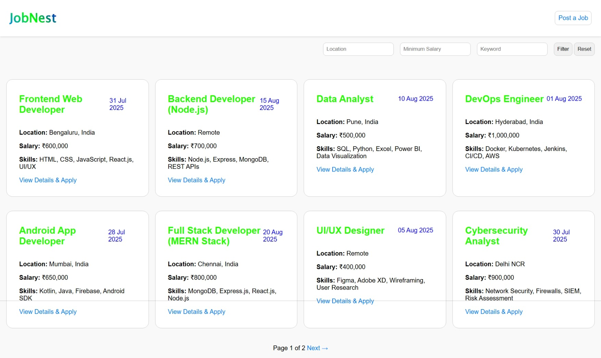

# 🧑‍💼 JobNest — Job Application Portal

**JobNest** is a complete full-stack job application system built using **PHP**, **MySQL**, and **JavaScript**, designed for internships, college placements, and entry-level job listings. It supports both public job browsing and admin job management.

---

## 🚀 Features

### 👤 Admin Panel
- Admin login/logout
- Add, edit, and delete jobs
- Toggle job status (Open/Closed)
- View applicants for each job
- Download applicant resumes (PDF)
- Export applicants as CSV
- See applicant counts for each job
- Sort applicants by application date (ASC/DESC)

### 🌐 Public Job Listing
- Filter jobs by:
  - **Location**
  - **Minimum Salary**
  - **Keyword** (in title, description, or skills)
- View job details
- Paginated job list (8 per page)
- Responsive design with mobile support

### 📝 Application Form
- Apply to jobs with:
  - Full name
  - Email (unique per job)
  - Phone number
  - Resume upload (PDF)
- Form submission via AJAX (no page reload)
- Duplicate application prevention
- Email shown as `mailto:` link

---

## 📁 Project Structure


<pre>
job-portal/
├── admin/
│ ├── add_job.php
│ ├── dashboard.php
│ ├── delete_job.php
│ ├── edit_job.php
│ ├── export_csv.php
│ ├── login.php
│ |── logout.php
│ └── view_applicants.php
├── applications/
│ ├── apply.php
│ └── submit_application.php
├── assets/
│ └── styles.css
├── includes/
│ ├── db.php
│ ├── functions.php
| └── logo.php
├── resumes/
│ └── [Uploaded PDF resumes]
├── .env.php
├── database.sql
│── index.php
│── job_detail.php
└── README.md
</pre>

---

## 🛠 Tech Stack

- **Backend**: PHP (MySQLi)
- **Database**: MySQL / MariaDB
- **Frontend**: HTML5, CSS3, JavaScript
- **AJAX**: Used for application form
- **Security**: Prepared statements, basic session auth

---

## 🧪 Setup Instructions

1. **Install XAMPP**
2. **Import the Database**
   - Open phpMyAdmin
   - Create a DB named `job_portal`
   - Import `database.sql`

3. **Project Setup**
   - Place the project in your `htdocs` or server folder
   - Edit `.env.php` to match your DB credentials:
     ```php
     return [
         'host' => 'localhost',
         'username' => 'root',
         'password' => '',
         'database' => 'job_portal',
     ];
     ```

4. **Launch**
   - Open your browser and go to:  
     `http://localhost/job-portal/index.php`
   - Admin Panel:  
     `http://localhost/job-portal/admin/login.php`  
     (Username: `admin`, Password: `admin123`)

---

## 🐛 Known Issues

- ⚠ **Admin login uses plain text validation**  
  Passwords are not hashed and there's no multi-user or role-based admin system.

- ⚠ **Salary stored as a single numeric value**  
  Only `salary_min` is supported; no `salary_max` or salary range filters yet.

- ⚠ **Resume upload lacks file size validation**  
  Only file type is checked (`.pdf`), but file size limit is not enforced.

- ⚠ **Applicant identity is email-only**  
  There is no login or applicant tracking system. Duplicate applications are blocked only by email + job ID.

- ⚠ **Mobile table usability**  
  Tables require horizontal scroll on smaller screens; no collapsible or stacked mobile layout.

- ⚠ **No email confirmation or notifications**  
  Application and admin actions are not linked to any email system.

---

## 🖼 Preview



---

## 👏 Credits

Created as part of an internship assessment for **Kurators**.
